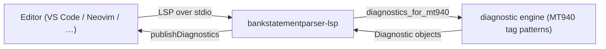

<!-- SPDX-License-Identifier: Apache-2.0 -->

<p align="center">
  
</p>

<h1 align="center">bankstatementparser-lsp</h1>

<p align="center">
  <b>Language Server Protocol server that lints MT940 bank-statement files as you type, backed by the bankstatementparser library.</b>
</p>

<p align="center">
  <a href="https://pypi.org/project/bankstatementparser-lsp/"></a>
  <a href="https://pypi.org/project/bankstatementparser-lsp/"></a>
  <a href="https://pypi.org/project/bankstatementparser-lsp/"></a>
  <a href="https://github.com/sebastienrousseau/bankstatementparser-lsp/actions/workflows/ci.yml"></a>
  <a href="https://github.com/sebastienrousseau/bankstatementparser-lsp/actions/workflows/ci.yml"></a>
  <a href="#license"></a>
</p>

---

## Contents

**Getting started**

- [What is bankstatementparser-lsp?](#what-is-bankstatementparser-lsp) — the problem it solves
- [Install](#install) — PyPI, virtualenv, Docker
- [Quick start](#quick-start) — wire it to your editor in 60 seconds

**Library reference**

- [Features](#features) — live MT940 diagnostics as you type
- [Editor wiring](#editor-wiring) — Neovim, VS Code, Helix, generic
- [Using the helpers](#using-the-helpers) — call the diagnostic engine from Python
- [The bankstatementparser suite](#the-bankstatementparser-suite) — core lib and LSP server

**Operational**

- [When not to use bankstatementparser-lsp](#when-not-to-use-bankstatementparser-lsp) — honest boundaries
- [Development](#development) — gates, make targets
- [Security](#security) — sandboxing posture
- [Documentation](#documentation) — examples, guides
- [Contributing](#contributing) — how to get changes in
- [License](#license) — Apache-2.0

---

## What is bankstatementparser-lsp?

A **Language Server** speaks the
[Language Server Protocol (LSP)](https://microsoft.github.io/language-server-protocol/) —
the editor-agnostic protocol that lets a single backend deliver
diagnostics to any LSP client (VS Code, Neovim, Helix, Emacs, …).
**bankstatementparser-lsp** is that backend for **MT940 bank-statement
files** (`.mt940` / `.sta`): the SWIFT tag-and-line format parsed by the
[`bankstatementparser`](https://github.com/sebastienrousseau/bankstatementparser)
library.

The diagnostic engine shares the MT940 tag patterns the
`bankstatementparser` parser relies on, so the squiggles you see in the
editor match the structure the parser will accept.

| Concern | How bankstatementparser-lsp handles it |
| :--- | :--- |
| Mandatory tags | Flags any missing `:20:`, `:25:`, `:28C:`, `:60F:`, `:62F:` tag |
| Balance lines | Validates `:60F:` / `:62F:` against `C/D + YYMMDD + 3-letter currency + amount` |
| Statement lines | Validates `:61:` against `YYMMDD + C/D + amount` |
| Information lines | Warns when an `:86:` line has no preceding `:61:` statement line |
| Live linting | Re-lints on open and on every change, publishing diagnostics back to the editor |

---

## Install

| Channel | Command | Notes |
| :--- | :--- | :--- |
| PyPI | `pip install bankstatementparser-lsp` | Pulls in `bankstatementparser >= 0.0.9` + `pygls` |
| Source | `git clone https://github.com/sebastienrousseau/bankstatementparser-lsp && cd bankstatementparser-lsp && poetry install` | For development |
| Docker (GHCR) | `docker pull ghcr.io/sebastienrousseau/bankstatementparser-lsp:latest` | Multi-arch (linux/amd64, linux/arm64); runs `bankstatementparser-lsp` over stdio |

Requires Python 3.10 or later. Works on macOS, Linux, and Windows.

Verify the installation:

```sh
python -c "import bankstatementparser_lsp; print('bankstatementparser-lsp', bankstatementparser_lsp.__version__)"
# -> bankstatementparser-lsp 0.0.1
```

<details>
<summary>Using an isolated virtual environment (recommended)</summary>

```sh
python -m venv venv
source venv/bin/activate        # macOS/Linux
venv\Scripts\activate           # Windows
python -m pip install -U bankstatementparser-lsp
```

</details>

---

## Quick start

The package installs a `bankstatementparser-lsp` console entry point that starts
the language server over **stdio**:

```sh
bankstatementparser-lsp
# -> (waiting on stdin for LSP JSON-RPC)
```

The command speaks LSP on stdin/stdout — it is meant to be launched by
your editor's LSP client, not used interactively. Wire it up
([Editor wiring](#editor-wiring)) and open any MT940 statement file
(`.mt940` / `.sta`); diagnostics light up as you type.

---

## Features

For MT940 bank-statement documents (one statement of SWIFT-style
`:tag:` lines), `bankstatementparser-lsp` publishes diagnostics:

| Rule code | Severity | Behaviour |
| :--- | :--- | :--- |
| `missing-tag` | error | A mandatory tag (`:20:`, `:25:`, `:28C:`, `:60F:`, `:62F:`) is absent |
| `malformed-balance` | error | A `:60F:` / `:62F:` balance line does not match `C/D + YYMMDD + 3-letter currency + amount` |
| `malformed-statement-line` | error | A `:61:` statement line does not match `YYMMDD + C/D + amount` |
| `orphan-information-line` | warning | An `:86:` information line has no preceding `:61:` statement line |

Diagnostics are republished on `textDocument/didOpen` and
`textDocument/didChange`, so the editor stays in sync on every keystroke.
An empty or whitespace-only document produces no diagnostics.

The feature logic lives in a pure, importable engine
(`diagnostics_for_mt940`, returning `Diagnostic` objects with a
`Severity`); the LSP handlers are thin glue that map those objects to
`lsprotocol` types.

---

## Editor wiring

Register `bankstatementparser-lsp` as the server `cmd` for MT940 files in
your editor's LSP client. MT940 files commonly use the `.mt940` or `.sta`
extension; most editors will need a filetype mapping for them.

<details>
<summary>Neovim (built-in <code>vim.lsp.config</code>)</summary>

```lua
-- Map the MT940 extensions to a filetype.
vim.filetype.add({
  extension = {
    mt940 = "mt940",
    sta = "mt940",
  },
})

vim.lsp.config["bankstatementparser"] = {
  cmd = { "bankstatementparser-lsp" },
  filetypes = { "mt940" },
  root_markers = { ".git" },
}
vim.lsp.enable("bankstatementparser")
```

</details>

<details>
<summary>VS Code (bundled scaffold)</summary>

A TypeScript language-client scaffold ships at
[`editors/vscode/`](editors/vscode/) — runnable straight from source:

```bash
cd editors/vscode
npm install
npm run compile
# Press F5 in VS Code to launch an Extension Development Host.
```

`bankstatementparser.serverCommand` (default `bankstatementparser-lsp`) is
exposed as a setting; the extension activates for `.mt940` / `.sta` files.

</details>

<details>
<summary>Helix / Emacs / generic LSP</summary>

Any client that can spawn a stdio language server will work. The
command is `bankstatementparser-lsp` and the documents are MT940
statement files (`.mt940` / `.sta`).

</details>

---

## Using the helpers

Because the diagnostic engine is pure, you can call it directly — no
editor or server process required. This is exactly what the server runs
on each edit:

```python
from bankstatementparser_lsp.diagnostics import diagnostics_for_mt940

# A clean MT940 statement produces no diagnostics.
clean = (
    ":20:STARTUMS\n"
    ":25:1234567890\n"
    ":28C:00001/001\n"
    ":60F:C230101EUR1000,00\n"
    ":61:2301020102C500,00NTRFNONREF//abc\n"
    ":86:Salary payment\n"
    ":62F:C230102EUR1500,00"
)
assert diagnostics_for_mt940(clean) == []

# Missing mandatory tags surface as errors.
diagnostics = diagnostics_for_mt940(":20:ONLY\n:61:2301020102C5,00NTRF")
print(len(diagnostics), "issue(s)")
# -> e.g. "4 issue(s)"

# Each diagnostic carries a 0-based range, a severity, and a rule code.
for d in diagnostics:
    print(d.line, d.code, d.message)
# -> 0 missing-tag Missing mandatory MT940 tag: :25:
#    ...
```

Each `Diagnostic` exposes `line`, `col_start`, `col_end`, `severity`
(a `Severity` enum matching the LSP numeric scale), `message`, and a
stable `code` — which the server maps to `lsprotocol.Diagnostic` before
publishing.

The runnable version of this snippet lives in
[`examples/01_lsp_helpers.py`](examples/01_lsp_helpers.py). See also
[`02_severity_filtering.py`](examples/02_severity_filtering.py) (grouping
by severity),
[`03_lsp_conversion.py`](examples/03_lsp_conversion.py) (the
`lsprotocol` conversion the server performs), and
[`04_server_publish.py`](examples/04_server_publish.py) (the server's
lint-and-publish path driven by a fake `LanguageServer`, so it runs
without an editor).

---

## The bankstatementparser suite

`bankstatementparser-lsp` is part of a set of independently installable packages
built around the [`bankstatementparser`](https://github.com/sebastienrousseau/bankstatementparser)
library — pick whichever ones your stack needs:

| Package | Role |
| :--- | :--- |
| [`bankstatementparser`](https://pypi.org/project/bankstatementparser/) | Core library + CLI (MT940 / CAMT parsing) |
| [`bankstatementparser-lsp`](https://pypi.org/project/bankstatementparser-lsp/) | **Language Server Protocol server (this package)** |



---

## When not to use bankstatementparser-lsp

- **You're not editing MT940 statements.** The server targets the SWIFT
  MT940 tag-and-line format (`.mt940` / `.sta`); for CAMT XML or other
  formats use a format-appropriate language server.
- **You need full parsing, not editor diagnostics.** Use the core
  [`bankstatementparser`](https://pypi.org/project/bankstatementparser/)
  library to parse statements into structured records.

---

## Development

`bankstatementparser-lsp` uses [Poetry](https://python-poetry.org/) and
[mise](https://mise.jdx.dev/).

```bash
git clone https://github.com/sebastienrousseau/bankstatementparser-lsp.git
cd bankstatementparser-lsp
mise install
poetry install
```

A `Makefile` orchestrates the quality gates (kept in lockstep with CI):

| Target | What it runs |
| :--- | :--- |
| `make check` | All gates (REQUIRED before commit) |
| `make test` | `pytest --cov=bankstatementparser_lsp --cov-branch --cov-fail-under=100` |
| `make lint` | `ruff check` + `ruff format --check` |
| `make type-check` | `mypy --strict` |
| `make examples` | Run the example scripts |

Current state (v0.0.1): **41 tests passing, 100% line + branch
coverage** against a 100% enforced floor, mypy `--strict` clean,
interrogate 100% docstring coverage. The suite includes documentation
and example regression tests
([`tests/test_docs_accuracy.py`](tests/test_docs_accuracy.py),
[`tests/test_regression_docs.py`](tests/test_regression_docs.py),
[`tests/test_regression_examples.py`](tests/test_regression_examples.py))
that execute every documented snippet and every `examples/*.py` script.

---

## Security

- **No filesystem writes.** The server reads from the editor's
  in-memory document buffer; no scratch files, no temp directories.
- **MT940 parsing** is a pure-`re` line scanner over text from the
  editor — no `eval`, no shelling out, no XML, no network.
- **Lint findings** are returned as `lsprotocol.Diagnostic` objects with
  no stack traces, so the editor never sees an internal path or
  exception message.
- **Dependencies** are pinned via `poetry.lock` and audited by
  `pip-audit` and Bandit in CI.

To report a vulnerability, please use
[GitHub private vulnerability reporting](https://github.com/sebastienrousseau/bankstatementparser-lsp/security)
rather than a public issue.

---

## Documentation

- **Runnable examples:** [`examples/`](https://github.com/sebastienrousseau/bankstatementparser-lsp/tree/main/examples)
- **VS Code scaffold:** [`editors/vscode/`](https://github.com/sebastienrousseau/bankstatementparser-lsp/tree/main/editors/vscode)
- **Release history:** [CHANGELOG.md](https://github.com/sebastienrousseau/bankstatementparser-lsp/blob/main/CHANGELOG.md)
- **Core library docs:** [docs.bankstatementparser.com](https://docs.bankstatementparser.com)
- **LSP specification:** [microsoft.github.io/language-server-protocol](https://microsoft.github.io/language-server-protocol/)

---

## Contributing

Contributions are welcome — see the
[contributing instructions](https://github.com/sebastienrousseau/bankstatementparser-lsp/blob/main/CONTRIBUTING.md).
Thanks to all the
[contributors](https://github.com/sebastienrousseau/bankstatementparser-lsp/graphs/contributors)
who have helped build `bankstatementparser-lsp`.

---

## License

Licensed under the [Apache License, Version 2.0](https://opensource.org/license/apache-2-0/).
Built on [pygls](https://github.com/openlawlibrary/pygls) and
[lsprotocol](https://github.com/microsoft/lsprotocol) by the
[Open Law Library](https://github.com/openlawlibrary), and on the core
[`bankstatementparser`](https://github.com/sebastienrousseau/bankstatementparser) library that
powers the validators and schemas.

Any contribution submitted for inclusion shall be licensed as above,
without additional terms.

---

<p align="center">
  <a href="https://bankstatementparser.com">bankstatementparser.com</a> ·
  <a href="https://pypi.org/project/bankstatementparser-lsp/">PyPI</a> ·
  <a href="https://github.com/sebastienrousseau/bankstatementparser-lsp">GitHub</a>
</p>
